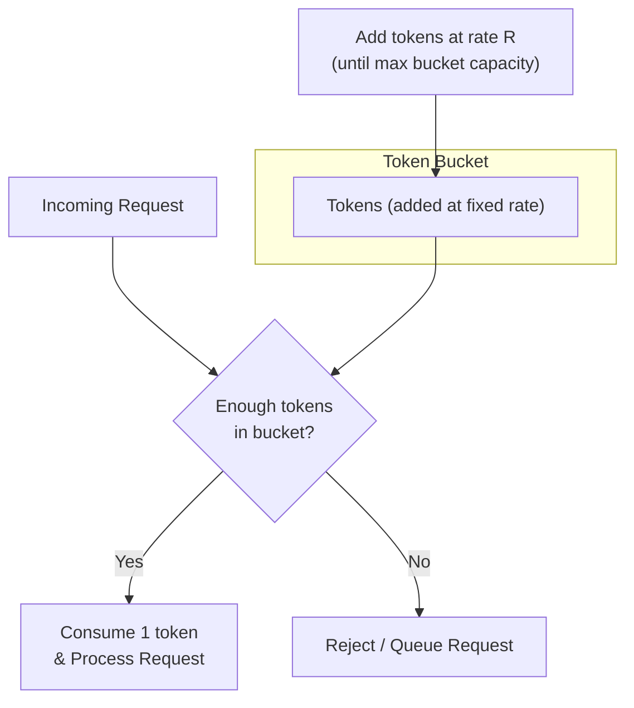

# Rate Limiters

## Challenge

Model provider APIs have rate limits. It's very easy to exceed these limits if you're making requests concurrently without throttling. In this challenge, you will build a rate limiter to throttle your requests when calling async APIs.


You will build a [token bucket rate limiter](https://medium.com/@surajshende247/token-bucket-algorithm-rate-limiting-db4c69502283). This works by maintaining a bucket with a fixed capacity that fills with tokens at a constant rate. Each incoming request consumes one token from the bucket. If tokens are available, the request is processed; otherwise, it's rejected or queued. This approach allows for burst traffic up to the bucket capacity while ensuring an average rate limit over time. 

In the last [chapter](llm-responses.md), you made concurrent requests to the Gemini API using `asyncio` and hit rate limits when you increased the number of requests.




### Step 0

Get a Gemini API key from [Google AI Studio](https://aistudio.google.com/app/api-keys). We use the Gemini API because it has a generous free tier.

```bash
export GEMINI_API_KEY="YOUR_API_KEY"
```

### Step 1

In this step, your goal is to make concurrent requests to the Gemini API and hit the rate limits.

Create a new script (`script.py`) that makes 20 concurrent requests using the async Gemini API. You can check the [LLM Responses](llm-responses.md) chapter to learn how to do this.

Run your script. You should get a resource exhausted error:

```bash
python script.py

> google.genai.errors.ClientError: 429 RESOURCE_EXHAUSTED. {'error': {'code': 429, 'message': 'You exceeded your current quota, please check your plan and billing details. For more information on this error, head to: https://ai.google.dev/gemini-api/docs/rate-limits. ...
```

At the time of writing, these were the free tier [rate limits](https://ai.google.dev/gemini-api/docs/rate-limits#current-rate-limits) for the Gemini API:

| Model | RPM | TPM | RPD |
|-------|-----|-----|-----|
| Gemini 2.5 Pro | 2 | 125,000 | 50 |
| Gemini 2.5 Flash | 10 | 250,000 | 250 |

### Step 2

## Solution